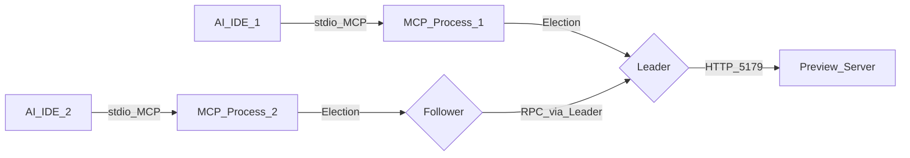
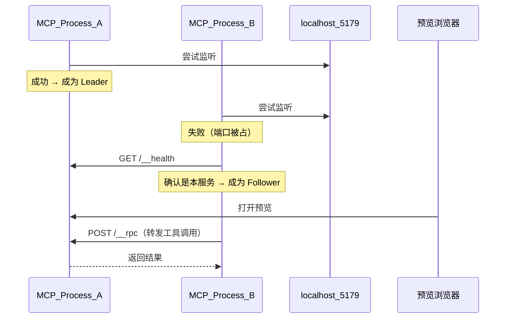

# OP 原型 MCP

按火花 OP 设计规范生成可预览 HTML。Skill 负责触发和工作流，MCP 负责校验、落盘、预览和导出。

```text
用户需求 → Skill → MCP → http://127.0.0.1:5179/<slug>/ → 修改仍走 MCP → 热更新 → 导出给开发
```

MCP **不自己画页面**。宿主 AI 读 Skill 写 HTML；MCP 是唯一出口。



**多编辑器支持**：多个 AI IDE（Cursor、Codex、Claude Code、Trae 等）可同时运行本 MCP。通过 Leader/Follower 选举，只有 Leader 占用 5179 端口，Follower 通过 Leader 协调预览。参见 [多 IDE 协调](#多-ide-协调leader--follower)。

- npm：https://www.npmjs.com/package/op-product-design-mcp
- 仓库：https://github.com/ChinaCarlos/op-product-design-mcp
- **完整接入说明（Codex / Cursor / Claude Code / Trae / Qoder / CodeBuddy / WorkBuddy）：** [docs/usage.md](docs/usage.md)

## 环境要求（先装 Node.js）

本工具跑在你自己的电脑上，预览是本机 `127.0.0.1:5179`，不是云端。

**必须先安装 Node.js ≥ 18**（会自带 `npm` / `npx`）。没装 Node 时，MCP 和 Skill 的安装命令都执行不了。

- 中文下载页：https://nodejs.org/zh-cn/download
- 英文官网：https://nodejs.org/
- macOS 也可用：`brew install node`

装完新开终端检查：

```bash
node -v    # 应 ≥ v18
npx -v
```

用的人不必装 pnpm、也不必 clone 仓库。改本仓库才需要 pnpm。配置里不要钉死版本。

## 快速开始

先接 MCP，再装 Skill。Skill **两种安装方式都支持**，选一种即可。

**1. 接入 MCP（任选一）**

Codex `~/.codex/config.toml`：

```toml
[mcp_servers.op-prototype]
command = "npx"
args = ["-y", "op-product-design-mcp"]
```

```bash
codex mcp add op-prototype -- npx -y op-product-design-mcp
```

Cursor / Trae / WorkBuddy / 多数编辑器，用户级或项目级 `mcp.json`：

```json
{
  "mcpServers": {
    "op-prototype": {
      "command": "npx",
      "args": ["-y", "op-product-design-mcp"]
    }
  }
}
```

| 平台 | 配置位置 |
|------|----------|
| Codex | `~/.codex/config.toml` 或项目 `.codex/config.toml` |
| Cursor | `~/.cursor/mcp.json` 或 `.cursor/mcp.json` |
| Claude Code | `claude mcp add`；`~/.claude.json` 或项目 `.mcp.json` |
| Trae | Settings → MCP；或 `.trae/mcp.json` |
| Qoder | Settings → MCP → Add |
| CodeBuddy | Settings → MCP |
| WorkBuddy | `~/.workbuddy/mcp.json` 或 `.workbuddy/mcp.json` |

逐步说明见 [docs/usage.md](docs/usage.md)。

**2. 安装 Skill（两种方式都支持）**

效果相同：自动拷到 Codex 的 `~/.agents/skills`，以及本机已有的 Cursor / Claude / Trae / CodeBuddy / WorkBuddy 目录。

方式一，npx：

```bash
npx -y op-product-design-mcp install
```

方式二，curl 脚本（类似 brew / oh-my-zsh）：

```bash
curl -fsSL https://raw.githubusercontent.com/ChinaCarlos/op-product-design-mcp/main/scripts/install.sh | bash
```

只配 MCP、忘了跑上面两条时，服务启动也会静默注入一次。

指定目录：

```bash
npx -y op-product-design-mcp install .cursor/skills
```

兼容旧命令：`npx -y op-product-design-mcp install-skill`。装完请新开一轮对话。

**3. 使用**

对 AI 说：「按火花 OP 规范，做/改 xxx 管理页原型」。

1. Skill 被选中，先 `get_brief`
2. `create_prototype` / `update_prototype`
3. 内置浏览器打开 `http://127.0.0.1:5179/<slug>/`（不要 `file://`）
4. 定稿 `export_prototype`，把 `out/<slug>/<slug>.html` 丢给开发

禁止绕开 MCP 改 hop `src/`，禁止 antd 5 / Tailwind / 真实接口。

## 工具

| 工具 | 作用 |
|------|------|
| `get_brief` | Skill + 硬规则 + 工作流 |
| `create_prototype` | 创建并打开预览 |
| `get_prototype` | 读当前 HTML，供增量修改 |
| `update_prototype` | 覆盖写入并热更新 |
| `start_preview` | 只启动/返回预览 URL |
| `list_prototypes` | 已有原型 |
| `validate_prototype` | 静态规范检查 |
| `export_prototype` | 导出可转发单文件 HTML 给开发 |
| `get_bundled_css` | 应内联的 tokens/theme/layout |

Resources：`op-prototype://skill`、`visual`、`template`、`example`、CSS。

预览默认只占 **5179** 一个端口，多页面用路径区分。写盘后按 slug 热更新。

工作稿：当前工作区 `out/<slug>/preview.html`。  
交付件：`out/<slug>/<slug>.html`（无热更新脚本、无下载按钮）。

## 本仓库开发

```bash
pnpm install
pnpm build
node dist/cli.js          # MCP stdio
npx -y op-product-design-mcp install
pnpm smoke
```

规范包：`skills/spark-op-prototype/SKILL.md`、`references/visual.md`、`styles/`、`templates/preview.html`、`examples/wall-manage.preview.html`。

环境变量：`OP_PROTOTYPE_OUT` 覆盖工作区根目录；`OP_PROTOTYPE_ROOT` 覆盖包根（一般不用）；`OP_PROTOTYPE_SKIP_SKILL_INSTALL=1` 关闭 MCP 启动时自动注入 Skill。

## 多 IDE 协调（Leader / Follower）

当多个 AI IDE（Cursor、Codex、Claude Code、Trae、Qoder、CodeBuddy、WorkBuddy 等）同时安装并运行本 MCP 时，会自动进行 Leader/Follower 选举，避免端口冲突。

### 工作原理



- **Leader**：绑定 5179 端口，提供 HTTP 预览服务，处理来自 Follower 的 RPC 请求
- **Follower**：文件操作（创建/修改原型）在本地执行，预览相关操作通过 Leader 协调
- **故障转移**：Leader 退出后，Follower 会尝试接管成为新 Leader（轮询间隔 3-5 秒）

### 单实例使用

单个 IDE 运行时，该进程自动成为 Leader，行为与之前完全一致。

### 验证多进程协调

```bash
# 终端 1：启动第一个 MCP（将成为 Leader）
node dist/cli.js
# 输出：[election] elected as leader

# 终端 2：启动第二个 MCP（将成为 Follower）
node dist/cli.js
# 输出：[election] following existing leader
```

两个进程都能正常响应工具调用，但只有 Leader 占用端口 5179。

### 环境变量

| 变量 | 作用 |
|------|------|
| `OP_PROTOTYPE_PORT` | 覆盖默认端口 5179 |

## License

MIT
