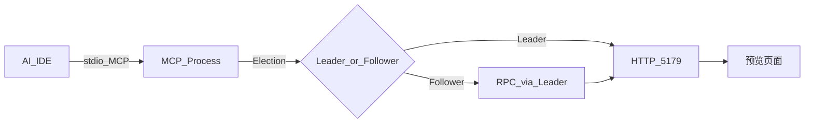
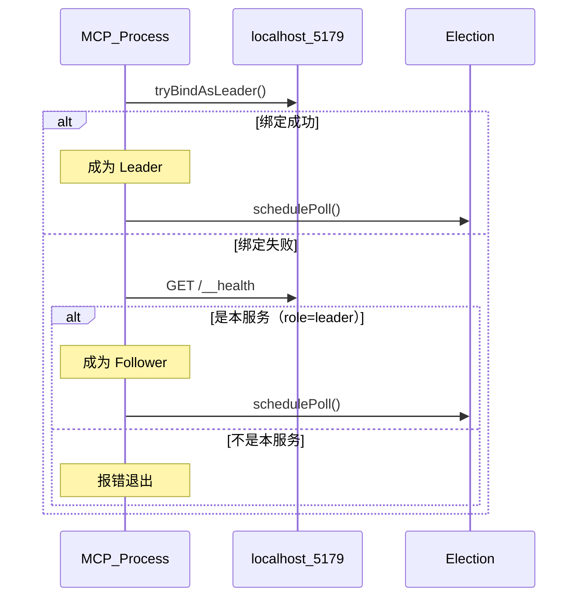

# 架构说明

本文档说明 op-product-design-mcp 的 Leader/Follower 选举机制。

## 目标

- 让多个 AI IDE（Cursor、Codex、Claude Code、Trae 等）同时运行本 MCP，不会端口冲突
- 只有一个进程（Leader）绑定预览端口 5179
- 其他进程（Follower）通过 Leader 协调预览服务
- Leader 退出后 Follower 可自动接管

## 模块结构

```text
src/
├── cli.ts              # 入口，启动选举和 MCP
├── election.ts         # 选举逻辑：Leader/Follower 判定与故障轮询
├── node.ts             # 角色管理：维护当前角色状态
├── follower.ts         # Follower RPC 客户端
├── preview.ts          # 预览 HTTP 服务（Leader 专属）
├── server.ts           # MCP 工具注册与 RPC 处理
├── types.ts            # Role 枚举与 RPC 类型
└── ...
```

## 流程概览



## 选举流程



## Leader 职责

- 绑定端口 5179，提供 HTTP 预览服务
- 提供 `/__health`、`/__prototypes`、`/__rpc`、`/__reload` 端点
- 处理来自 Follower 的 RPC 请求
- 广播热更新事件

## Follower 职责

- 本地执行文件操作（读写原型 HTML）
- 预览相关操作通过 Leader 的 `/__rpc` 转发
- 轮询检测 Leader 存活（3-5 秒）
- Leader 消失时尝试接管

## RPC 协议

### `GET /__health`

```json
{ "ok": true, "service": "op-prototype-preview", "port": 5179, "role": "leader" }
```

### `GET /__prototypes`

```json
{
  "ok": true,
  "prototypes": [
    { "slug": "wall-manage", "title": "墙管理", "file": "...", "previewUrl": "..." }
  ]
}
```

### `POST /__rpc`

请求：
```json
{ "tool": "start_preview", "params": { "slug": "wall-manage" } }
```

响应：
```json
{ "ok": true, "data": { "port": 5179, "previewUrl": "..." } }
```

### `POST /__reload`

触发热更新广播，可选 `?slug=xxx` 参数。

## 设计原则

1. **单实例兼容**：单 IDE 运行时自动成为 Leader，行为不变
2. **文件共享**：所有进程共享同一 `out/` 目录
3. **透明代理**：Follower 的工具调用对 AI 透明
4. **故障恢复**：Leader 退出后 Follower 自动接管
5. **本地优先**：所有流量在 localhost，无云依赖
